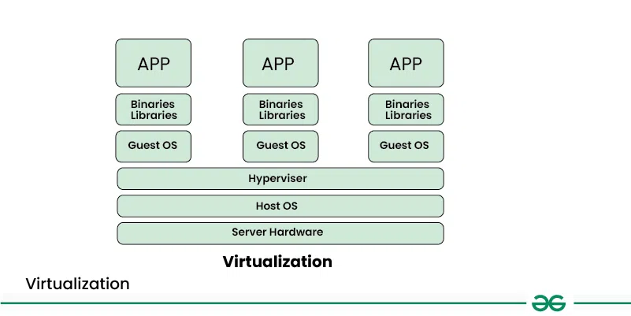
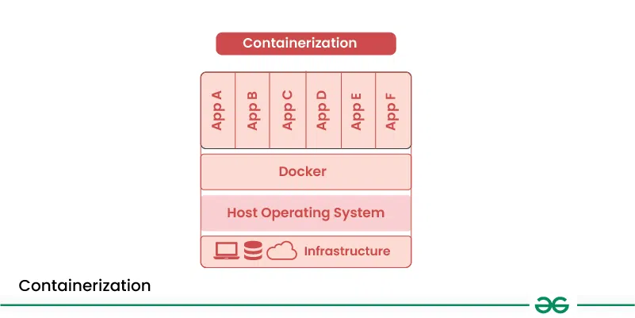
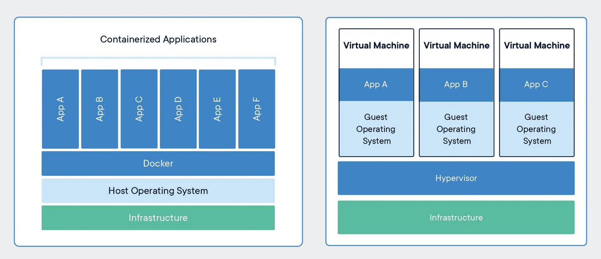
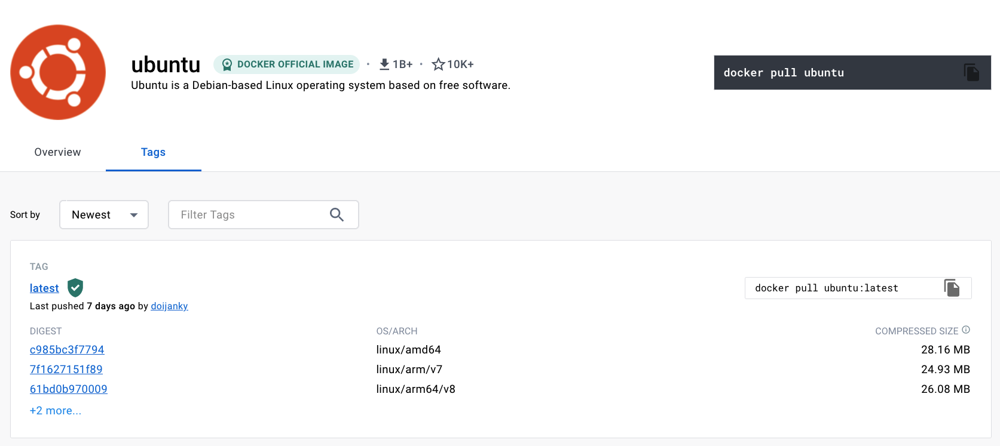

Virtualization:
==============

  Virtualization: is a technology that creates virtual versions of computer resources such as hardware platforms, operating systems, storage devices, and network resources. It’s like creating a software-based replica of a physical machine, allowing you to run multiple isolated environments on the same hardware or across a distributed system.

     1.  Imagine you have a powerful computer but you only use a small portion of its resources. 
    2. Virtualization allows you to split that computer into several virtual machines (VMs), each acting like a separate computer with its operating system and applications. 
    3. Each virtual machine is isolated from the others, meaning issues in one virtual machine won’t affect others. 
    4. This allows you to optimize resource utilization, run multiple applications on a single machine, and improve scalability by easily adding or removing virtual machines as needed.

Diagram of virtualization:
==============================

what is containers:
================================

Containerization is the practice of packaging an application together with everything it needs to run—its code, runtime, system libraries, and dependencies—into a single, isolated unit called a container. Because containers share the host operating system’s kernel but run in separate user spaces, they start up in seconds, use far fewer resources than full virtual machines, and behave the same on any environment that supports the container runtime.

Containers provide process isolation, ensuring that applications running in one container do not affect applications running in other containers.
Containers encapsulate all dependencies and configuration required to run an application, making them portable across different environments.
Containers are lightweight compared to traditional virtual machines (VMs) because they share the host operating system kernel.
Containers are designed to be scalable, allowing you to quickly scale up or down based on demand.
Containers enable developers to build, test, and deploy applications more efficiently, leading to faster release cycles and improved collaboration between development and operations teams.

What is a container ?
=====================
A container is a standard unit of software that packages up code and all its dependencies so the application runs quickly and reliably from one computing environment to another. A Docker container image is a lightweight, standalone, executable package of software that includes everything needed to run an application: code, runtime, system tools, system libraries and settings.

Ok, let me make it easy !!!

A container is a bundle of Application, Application libraries required to run your application and the minimum system dependencies.

Containers vs Virtual Machine:
================================

1. Resource Utilization: Containers share the host operating system kernel, making them lighter and faster than VMs. VMs have a full-fledged OS and hypervisor, making them more resource-intensive.

2. Portability: Containers are designed to be portable and can run on any system with a compatible host operating system. VMs are less portable as they need a compatible hypervisor to run.

3. Security: VMs provide a higher level of security as each VM has its own operating system and can be isolated from the host and other VMs. Containers provide less isolation, as they share the host operating system.

4. Management: Managing containers is typically easier than managing VMs, as containers are designed to be lightweight and fast-moving.

Why are containers light weight ?:
=================================

Containers are lightweight because they package only the application and its dependencies, while sharing the host OS kernel instead of running a full operating system.

Let's try to understand this with an example:

Below is the screenshot of official ubuntu base image which you can use for your container. It's just ~ 22 MB, isn't it very small ? on a contrary if you look at official ubuntu VM image it will be close to ~ 2.3 GB. So the container base image is almost 100 times less than VM image.

=======
A container is a bundle of Application, Application libraries required to run your application and the minimum system dependencies.

