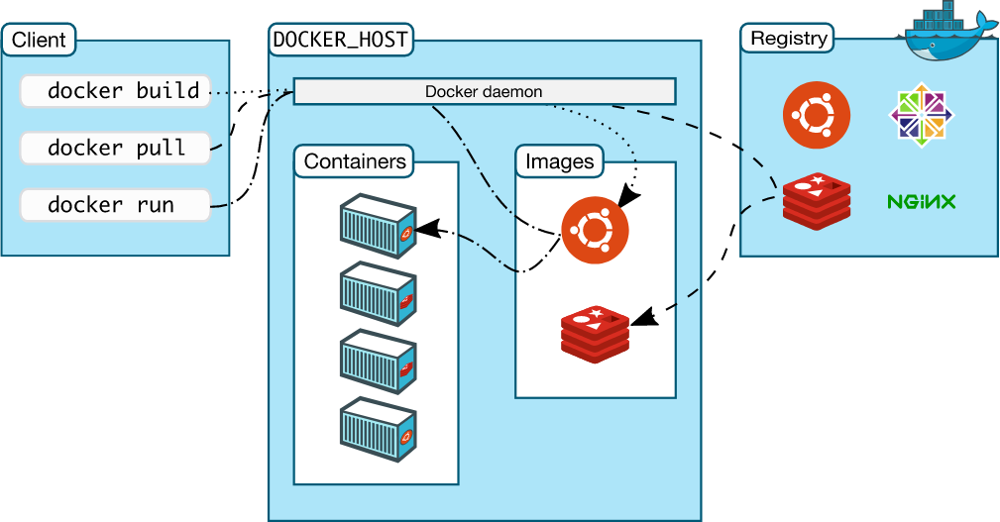
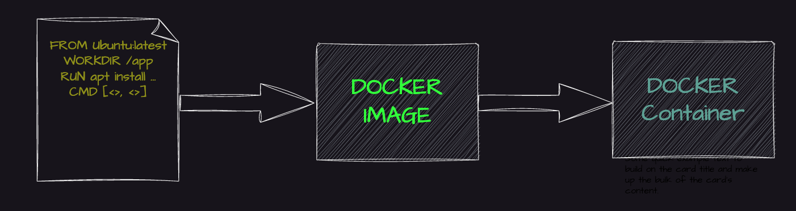

What is Docker ?:
================

Docker is a containerization platform that provides easy way to containerize your applications, which means, using Docker you can build container images, run the images to create containers and also push these containers to container regestries such as DockerHub, Quay.io and so on.

In simple words, you can understand as containerization is a concept or technology and Docker Implements Containerization.

Docker is a containerization platform that provides easy way to containerize your applications, which means, using Docker you can build container images, run the images to create containers and also push these containers to container regestries such as DockerHub, Quay.io and so on.

In simple words, you can understand as containerization is a concept or technology and Docker Implements Containerization.

The above picture, clearly indicates that Docker Deamon is brain of Docker. If Docker Deamon is killed, stops working for some reasons, Docker is brain dead :p (sarcasm intended).

Docker LifeCycle:
=================
We can use the above Image as reference to understand the lifecycle of Docker.

There are three important things,

docker build -> builds docker images from Dockerfile
docker run -> runs container from docker images
docker push -> push the container image to public/private regestries to share the docker images.

Understanding the terminology (Inspired from Docker Docs):
==========================================================

Docker daemon:
=============

The Docker daemon (dockerd) listens for Docker API requests and manages Docker objects such as images, containers, networks, and volumes. A daemon can also communicate with other daemons to manage Docker services.

Docker client:
===================

The Docker client (docker) is the primary way that many Docker users interact with Docker. When you use commands such as docker run, the client sends these commands to dockerd, which carries them out. The docker command uses the Docker API. The Docker client can communicate with more than one daemon.

Docker Desktop:
==================
Docker Desktop is an easy-to-install application for your Mac, Windows or Linux environment that enables you to build and share containerized applications and microservices. Docker Desktop includes the Docker daemon (dockerd), the Docker client (docker), Docker Compose, Docker Content Trust, Kubernetes, and Credential Helper. For more information, see Docker Desktop.

Docker registries:
====================
A Docker registry stores Docker images. Docker Hub is a public registry that anyone can use, and Docker is configured to look for images on Docker Hub by default. You can even run your own private registry.

When you use the docker pull or docker run commands, the required images are pulled from your configured registry. When you use the docker push command, your image is pushed to your configured registry. Docker objects

When you use Docker, you are creating and using images, containers, networks, volumes, plugins, and other objects. This section is a brief overview of some of those objects.

Dockerfile
Dockerfile is a file where you provide the steps to build your Docker Image.

Images
An image is a read-only template with instructions for creating a Docker container. Often, an image is based on another image, with some additional customization. For example, you may build an image which is based on the ubuntu image, but installs the Apache web server and your application, as well as the configuration details needed to make your application run.

You might create your own images or you might only use those created by others and published in a registry. To build your own image, you create a Dockerfile with a simple syntax for defining the steps needed to create the image and run it. Each instruction in a Dockerfile creates a layer in the image. When you change the Dockerfile and rebuild the image, only those layers which have changed are rebuilt. This is part of what makes images so lightweight, small, and fast, when compared to other virtualization technologies.